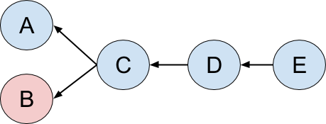
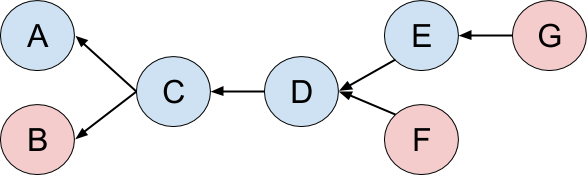

# Code structure

## Framework

The framework is a crude approximation of the [CMS](https://cms.cern/)
data processing software, [CMSSW](http://cms-sw.github.io/). CMSSW is
a rather generic framework to process independent chunks of data. In
CMS these chunks of data correspond to triggered proton-proton
collisions, and are called events. The events are processed by
modules, that in this project are all "producers" that can read
objects from the event, and insert new objects to the event (in CMSSW
there are, in addition, analyzers, that can only read objects from the
event, and filters, that can decide to stop processing of the event).

The modules form a DAG based on their data dependencies. The modules
are implemented in C++ (C++17 in general, CUDA code is in C++14). A
CMSSW job is configured in Python (this project does not provide
configuration mechanism).

The CMSSW framework is multi-threaded using [Threading Building Blocks
(TBB)](https://github.com/intel/tbb). An integral part of the
multi-threading is a concept of ["concurrent event
processor"](../src/cuda/bin/StreamSchedule.h) that we call "a stream"
(to disambiguate from CUDA streams, these streams are called "EDM
streams" from now on). An EDM stream processes one event at a time
("processing" meaning that each module in the DAG is run on the event
in some order respecting the data dependencies). A job may have
multiple EDM streams, in which case the EDM streams process their
events concurrently. Furthermore, modules processing the same event
that are independent in the DAG are also run concurrently. All this
potential concurrency is exposed as tasks to be run by the TBB task
scheduler. We do not make any assumptions on how TBB runs these tasks
in threads (e.g. number of EDM streams and number of threads may be
different). For more information on CMSSW framework see e.g.
- CMS TWiki pages
  - [SWGuideFrameWork](https://twiki.cern.ch/twiki/bin/view/CMSPublic/SWGuideFrameWork)
  - [MultithreadedFrameworkDesignDiscussions](https://twiki.cern.ch/twiki/bin/view/CMSPublic/MultithreadedFrameworkDesignDiscussions)
  - The CMS Offline WorkBook [WorkBook](https://twiki.cern.ch/twiki/bin/view/CMSPublic/WorkBook)
  - The CMS Offline SW Guide [SWGuide](https://twiki.cern.ch/twiki/bin/view/CMSPublic/SWGuide)
- Papers
  - [C D Jones et al 2014, J. Phys. Conf. Ser. 513 022034](https://iopscience.iop.org/article/10.1088/1742-6596/513/2/022034)
  - [C D Jones et al 2015, J. Phys. Conf. Ser. 664 072026](https://iopscience.iop.org/article/10.1088/1742-6596/664/7/072026)
  - [C D Jones et al 2017, J. Phys. Conf. Ser. 898 042008](https://iopscience.iop.org/article/10.1088/1742-6596/898/4/042008)

The processing time and memory requirements can vary a lot across
events. In addition, the filtering capability may affect which modules
in the DAG can be run.

The main approximations of the framework in this project with respect to CMSSW are
- producer modules only, and only stream and stream-ExternalWork producers
- modules and the event products have no labels, and therefore the event can hold only at most one product of each C++ type
- no run time configuration mechanism
- input data are fully read in memory at the beginning of the job
- EventSetup system has a single (implicit) record, one IOV, all products are read from binary dumps at the beginning of the job.

## Overall view on the use of CUDA

Our overall aims are to avoid blocking synchronization as much as
possible, and keep all processing units (CPU cores, GPUs) as busy as
we can doing useful work. It follows that we try to have all
operations (memory transfers, kernel calls) asynchronous with the use
of CUDA streams, and that we use callback functions
(`cudaStreamAddCallback()`) to notify the CMSSW framework when the
asynchronous work has finished.

We use a "caching allocator" (based on the one from
[CUB](https://nvlabs.github.io/cub/) library) for both device and
pinned host memory allocations. This approach allows us to amortize
the cost of the `cudaMalloc()`/`cudaFree()` etc, while being able to
easily re-use device/pinned host memory regions for temporary
workspaces, to avoid "conservative" overallocation of memory, and to
avoid constraining the scheduling of modules to multiple devices.

We use one CUDA stream for each EDM stream ("concurrent event") and
each linear chain of GPU modules that pass data from one to the other
in the device memory. In case of branches in the DAG of modules,
additional CUDA streams are used since there is sub-event concurrency
in the DAG that we want to expose to CUDA runtime.

For more information see [cms-sw/cmssw:`HeterogeneousCore/CUDACore/README.md`](https://github.com/cms-sw/cmssw/blob/CMSSW_11_1_0_pre4/HeterogeneousCore/CUDACore/README.md).

## Application structure

The pixel tracking GPU prototype consists of five modules that are run according to their data dependencies (roughly in the following order)
- [`BeamSpotToCUDA`](#beamspot-transfer-beamspottocuda) (A)
- [`SiPixelRawToClusterCUDA`](#raw-to-cluster-sipixelrawtoclustercuda) (B)
- [`SiPixelRecHitCUDA`](#rechits-sipixelrechitcuda) (C)
- [`CAHitNtupletCUDA`](#pattern-recognition-with-cellular-automaton-cahitntupletcuda) (D)
- [`PixelVertexProducerCUDA`](#vertexing-pixelvertexproducercuda) (E)

The data dependencies of the modules form the following DAG

In addition, there are two modules to transfer the tracks and vertices back to CPU (enabled only with `--transfer` parameter)
- [`PixelTrackSoAFromCUDA`](#transfer-tracks-to-host-pixeltracksoafromcuda) (F)
- [`PixelVertexSoAFromCUDA`](#transfer-vertices-to-host-pixelvertexsoafromcuda) (G)

With the transfers the module DAG becomes

The application reads uncompressed raw data for just the pixel detector (about
250 kB/event). This configuration is somewhat artificial, e.g. almost
nothing is transferred back to CPU, at the moment there are no modules
that would consume the data in the format produced by this workflow,
and in offline data processing the input data is
compressed.

For more information on the application see
* https://patatrack.web.cern.ch/patatrack/wiki/
* [CHEP 2019: A. Bocci: Heterogeneous online reconstruction at CMS](https://indico.cern.ch/event/773049/contributions/3474336/attachments/1940557/3217478/Heterogeneous_online_reconstruction_at_CMS.pdf)
* [ACAT 2019: A. Bocci: Towards a heterogeneous High Level Trigger farm for CMS](https://indico.cern.ch/event/708041/contributions/3276337/attachments/1810853/2957376/Towards_a_heterogeneous_computing_farm_for_the_CMS_High_Level_Trigger.pdf)
* [Connecting The Dots 2019: F. Pantaleo: Patatrack: accelerated Pixel Track reconstruction in CMS](https://indico.cern.ch/event/742793/contributions/3274390/attachments/1821674/2979847/20190402_Felice_CTD.pdf)
* [F. Pantaleo: New Track Seeding Techniques for the CMS Experiment (PhD thesis)](http://ediss.sub.uni-hamburg.de/volltexte/2018/9070/pdf/Dissertation.pdf)

### BeamSpot transfer ([`BeamSpotToCUDA`](../src/cuda/plugin-BeamSpotProducer/BeamSpotToCUDA.cc))

This module transfers information about the average beam collision
region ("beam spot") from the host to the device for each event.

| Operation | Description |
|-----------|-------------|
| [memcpy host-to-device 44 B](../src/cuda/CUDADataFormats/BeamSpotCUDA.cc#L8) | Transfer [`BeamSpotCUDA::Data`](../src/cuda/CUDADataFormats/BeamSpotCUDA.h#L12-L21) for  position and other information about the beam spot |

These essentially only transfer data from CPU to GPU.

### Raw-to-cluster ([`SiPixelRawToClusterCUDA`](../src/cuda/plugin-SiPixelRawToDigi/SiPixelRawToClusterCUDA.cc))

This module that unpacks and reformats the raw to into something
usable to downstream, applies some calibration, and forms clusters of
pixels on each pixel detector module.

The following memory transfers are done once per job on the first event from [`SiPixelRawToClusterCUDA.cc`](../src/cuda/plugin-SiPixelRawToDigi/SiPixelRawToClusterCUDA.cc)
| Operation | Description |
|-----------|-------------|
| [memcpy host-to-device 1.44 MB](../src/cuda/CondFormats/SiPixelFedCablingMapGPUWrapper.cc#L32-L34) | Transfer [`SiPixelFedCablingMapGPU`](../src/cuda/CondFormats/SiPixelFedCablingMapGPU.h#L15-L24) for pixel detector cabling map |
| [memcpy host-to-device 57.6 kB](../src/cuda/CondFormats/SiPixelFedCablingMapGPUWrapper.cc#L43-L47) | Transfer [an array of module indices to be unpacked](../src/cuda/CondFormats/SiPixelFedCablingMapGPUWrapper.h#L28). This is to support regional unpacking in CMSSW, even though this functionality is not used in this project. |
| [memcpy host-to-device 3.09 MB](../src/cuda/CondFormats/SiPixelGainCalibrationForHLTGPU.cc#L26-#L27) | Transfer [gain calibration data](../src/cuda/CondFormats/SiPixelGainCalibrationForHLTGPU.h#L19) |
| [memcpy host-to-device 24.05 kB](../src/cuda/CondFormats/SiPixelGainCalibrationForHLTGPU.cc#L29-#L30) | Transfer [`SiPixelGainForHLTonGPU`](../src/cuda/CondFormats/SiPixelGainForHLTonGPU.h#L16-L61) for gain calibration |
| [memcpy host-to-device 8 B](../src/cuda/CondFormats/SiPixelGainCalibrationForHLTGPU.cc#L31-#L35) | Set the gain calibration data pointer in `SiPixelGainForHLTonGPU` struct |

The following CUDA operations are issued for each event from [`SiPixelRawToClusterGPUKernel.cu`](../src/cuda/plugin-SiPixelRawToDigi/SiPixelRawToClusterGPUKernel.cu)
| Operation | Description |
|-----------|-------------|
| [memcpy host-to-device 40 B](../src/cuda/CUDADataFormats/SiPixelDigisCUDA.cc#L25) | Transfer [`SiPixelDigisCUDA::DeviceConstView`](../src/cuda/CUDADataFormats/SiPixelDigisCUDA.h#L58-L76) for SoA of pixel digis (= unpacked raw data) |
| [memset 3.6 MB](../src/cuda/CUDADataFormats/SiPixelDigiErrorsCUDA.cc#L15) | Zero unpacking error array |
| [memcpy host-to-device 16 B](../src/cuda/CUDADataFormats/SiPixelDigiErrorsCUDA.cc#L22) | Transfer `GPU::SimpleVector<PixelErrorcompact>` to provide `std::vector`-like interface for the unpacking error array |
| [memcpy host-to-device 32 B](../src/cuda/CUDADataFormats/SiPixelClustersCUDA.cc#L20) | Transfer [`SiPixelClustersCUDA::DeviceConstView`](../src/cuda/CUDADataFormats/SiPixelClustersCUDA.h#L40-L56) for SoA of pixel clusters |
| [memcpy host-to-device X B](../src/cuda/plugin-SiPixelClusterizer/SiPixelRawToClusterGPUKernel.cu#L562-L563) | Transfer raw data words |
| [memcpy host-to-device X B](../src/cuda/plugin-SiPixelClusterizer/SiPixelRawToClusterGPUKernel.cu#L564-L565) | Transfer IDs for FEDs that provided data |
| [`pixelgpudetails::RawToDigi_kernel()`](../src/cuda/plugin-SiPixelClusterizer/SiPixelRawToClusterGPUKernel.cu#L355-L524) | Kernel to unpack the raw data into data structure usable for subsequent kernels |
| [memcpy device-to-host 16 B](../src/cuda/CUDADataFormats/SiPixelDigiErrorsCUDA.cc#L26) | Transfer `GPU::SimpleVector<PixelErrorcompact>`, i.e. essentially the number of errors, to host |
| [`gpuCalibPixel::calibDigis()`](../src/cuda/plugin-SiPixelClusterizer/gpuCalibPixel.h#L21-L64) | Calibrate pixel digis (ADC counts) |
| [`gpuClustering::countModules()`](../src/cuda/plugin-SiPixelClusterizer/gpuClustering.h#L19-L37) | Fills starting index into the ADC (etc) arrays for each active module |
| [memcpy device-to-host 4 B](../src/cuda/plugin-SiPixelClusterizer/SiPixelRawToClusterGPUKernel.cu#L628-L629) | Transfer number of active modules to host |
| [`gpuClustering::findClus()`](../src/cuda/plugin-SiPixelClusterizer/gpuClustering.h#L39-L302) | Cluster digis on each pixel module |
| [`gpuClustering::clusterChargeCut()`](../src/cuda/plugin-SiPixelClusterizer/gpuClusterChargeCut.h#L14-L121) | Select clusters whose aggregated electric charge is above a given threshold |
| [`pixelgpudetails::fillHitsModuleStart()`](../src/cuda/plugin-SiPixelClusterizer/SiPixelRawToClusterGPUKernel.cu#L355-L524)
| [memcpy device-to-host 4 B](../src/cuda/plugin-SiPixelClusterizer/SiPixelRawToClusterGPUKernel.cu#L669-L673) | Transfer number of pixel clusters to host |

### RecHits [`SiPixelRecHitCUDA`](../src/cuda/plugin-SiPixelRecHits/SiPixelRecHitCUDA.cc)

This module computes the 3D position estimate for each cluster.

The following CUDA operations are issued for each event from [`PixelRecHits.cu`](../src/cuda/plugin-SiPixelRecHits/PixelRecHits.cu)
| Operation | Description |
|-----------|-------------|
| [memcpy host-to-device 152 B](../src/cuda/CUDADataFormats/TrackingRecHit2DHeterogeneous.h#L92) | Transfer [`TrackingRecHit2DSOAView`](../src/cuda/CUDADataFormats/TrackingRecHit2DSOAView.h#L15-L98) for SoA of pixel hits |
| [`gpuPixelRecHits::getHits()`](../src/cuda/plugin-SiPixelRecHits/gpuPixelRecHits.h#L16-L215) | Calculates 3D position for each cluster |
| [`setHitsLayerStart()`](../src/cuda/plugin-SiPixelRecHits/PixelRecHits.cu#L18-L31) | Set index of the first hit for each pixel detector layer |
| [`cudautils::countFromVector()`](../src/cuda/CUDACore/HistoContainer.h#L25-L39) | First kernel of four to fill a phi-binned histogram of the hits. This kernel counts the number of elements for each bin  |
| `cub::DeviceScanInitKernel()` | Part of `cub::DeviceScan::InclusiveSum()` called from [`cms::cuda::launchFinalize()`](../src/cuda/CUDACore/HistoContainer.h#L89) |
| `cub::DeviceScanKernel()` | Part of `cub::DeviceScan::InclusiveSum()` called from [`cms::cuda::launchFinalize()`](../src/cuda/CUDACore/HistoContainer.h#L89) |
| [`cudautils::fillFromVector()`](../src/cuda/CUDACore/HistoContainer.h#L41-L55) | Last kernel of four to fill a phi-binned histogram of the hits. This kernel fills each bin with the hits. |

### Pattern recognition (with Cellular Automaton) ([`CAHitNtupletCUDA`](../src/cuda/plugin-PixelTriplets/CAHitNtupletCUDA.cc))

This module performs the "pattern recognition":
* create pairs of pixel hits on adjacent layers
* connect the pairs to form ntuplets (triplets or quadruplets)
* fit the ntuplets with a helix

The following CUDA operations are issued for each event from [`CAHitNtupletGeneratorKernels.cu`](../src/cuda/plugin-PixelTriplets/CAHitNtupletGeneratorKernels.cu) and [`BrokenLineFitOnGPU.cu`](../src/cuda/plugin-PixelTriplets/BrokenLineFitOnGPU.cu)
| Operation | Description |
|-----------|-------------|
| [memset 4 B](../src/cuda/plugin-PixelTriplets/CAHitNtupletGeneratorKernelsAlloc.h#L45) | Zero the number of doublets (CA cells) |
| [memset 36 B](../src/cuda/plugin-PixelTriplets/CAHitNtupletGeneratorKernelsAlloc.h#L49) | Zero [counter of ntuplets](../src/cuda/plugin-PixelTriplets/CAConstants.h#L65) |
| [memset 197 kB](../src/cuda/plugin-PixelTriplets/CAHitNtupletGeneratorKernelsAlloc.h#L50) | Zero [association structure from hits to ntuplets](../src/cuda/plugin-PixelTriplets/CAConstants.h#L63-L64) |
| [`gpuPixelDoublets::initDoublets()`](../src/cuda/plugin-PixelTriplets/gpuPixelDoublets.h#L68-L78) | Initialize pair/doublet finding data structure |
| [`gpuPixelDoublets::getDoubletsFromHisto()`](../src/cuda/plugin-PixelTriplets/gpuPixelDoublets.h#L83-L117) | Create the hit pairs/doublets |
| [memset 131 kB](../src/cuda/plugin-PixelTriplets/CAHitNtupletGeneratorKernels.cu#L24) | Zero [ntuplet finding data structure](../src/cuda/CUDADataFormats/PixelTrackHeterogeneous.h#L65) |
| [`kernel_connect()`](../src/cuda/plugin-PixelTriplets/CAHitNtupletGeneratorKernelsImpl.h#L193-#L264) | Connect compatible pairs/doublets |
| [`gpuPixelDoublets::fishbone()`](../src/cuda/plugin-PixelTriplets/gpuFishbone.h#L21-#L90) | Identify duplicate ntuplets (a single particle can induce multiple hits per layer because of redundancies in the detector) |
| [`kernel_find_ntuplets`](../src/cuda/plugin-PixelTriplets/CAHitNtupletGeneratorKernelsImpl.h#L266-#L293) | Find ntuplets from the doublet connection graph (the actual Cellular Automaton) |
| [`cudautils::finalizeBulk()`](../src/cuda/CUDACore/HistoContainer.h#L123-L126) |finalize data structures (Histogrammer/OnetoManyAssoc) filled in the previous kernel |
| [`kernel_earlyDuplicateRemover()`](../src/cuda/plugin-PixelTriplets/CAHitNtupletGeneratorKernelsImpl.h#L120-#L151) | Clean duplicate ntuplets |
| [`kernel_countMultiplicity()`](../src/cuda/plugin-PixelTriplets/CAHitNtupletGeneratorKernelsImpl.h#L307-#L323) | Count the number of ntuplets with different numbers of hits |
| `cub::DeviceScanInitKernel()` | Part of `cub::DeviceScan::InclusiveSum()` called from [`cms::cuda::launchFinalize()`](../src/cuda/CUDACore/HistoContainer.h#L89) |
| `cub::DeviceScanKernel()` | Part of `cub::DeviceScan::InclusiveSum()` called from [`cms::cuda::launchFinalize()`](../src/cuda/CUDACore/HistoContainer.h#L89) |
| [`kernel_fillMultiplicity()`](../src/cuda/plugin-PixelTriplets/CAHitNtupletGeneratorKernelsImpl.h#L325-#L341) | Fills a nhit-binned histogram of the ntuplets. |
| [`kernel_fillHitDetIndices`](../src/cuda/plugin-PixelTriplets/CAHitNtupletGeneratorKernelsImpl.h#L452-#L467) | fill for each ht-tuple  a tuple with just the det-indices. |
| [`kernelBLFastFit<3>()`](../src/cuda/plugin-PixelTriplets/BrokenLineFitOnGPU.h#L27-#L118) | First step of fitting triplets |
| [`kernelBLFit<3>()`](../src/cuda/plugin-PixelTriplets/BrokenLineFitOnGPU.h#L120-#L187) | Second step of fitting triplets |
| [`kernelBLFastFit<4>()`](../src/cuda/plugin-PixelTriplets/BrokenLineFitOnGPU.h#L27-#L118) | First step of fitting quadruplets |
| [`kernelBLFit<4>()`](../src/cuda/plugin-PixelTriplets/BrokenLineFitOnGPU.h#L120-#L187) | Second step of fitting quadruplets |
| [`kernelBLFastFit<4>()`](../src/cuda/plugin-PixelTriplets/BrokenLineFitOnGPU.h#L27-#L118) | First step of fitting pentuplets (only first 4 hits) |
| [`kernelBLFit<4>()`](../src/cuda/plugin-PixelTriplets/BrokenLineFitOnGPU.h#L120-#L187) | Second step of fitting pentuplets (only first 4 hits) |
| [`kernel_classifyTracks`](../src/cuda/plugin-PixelTriplets/CAHitNtupletGeneratorKernelsImpl.h#L343-#L409) | Classify fitted tracks according to certain quality criteria |
| [`kernel_fastDuplicateRemover`](../src/cuda/plugin-PixelTriplets/CAHitNtupletGeneratorKernelsImpl.h#L153-#L191) | Identify duplicate tracks |

### Vertexing ([`PixelVertexProducerCUDA`](../src/cuda/plugin-PixelVertexFinding/PixelVertexProducerCUDA.cc))

This module reconstruct vertices, i.e. finds clusters of track "origin
points" that likely correspond to proton-proton collision points.

The following CUDA operations are issued for each event from [`gpuVertexFinderImpl.h`](../src/cuda/plugin-PixelVertexFinding/gpuVertexFinderImpl.h)
| Operation | Description |
|-----------|-------------|
| [`gpuVertexFinder::init()`](../src/cuda/plugin-PixelVertexFinding/gpuVertexFinder.h#L35-L38) | Zero data structures |
| [`gpuVertexFinder::loadTracks()`](../src/cuda/plugin-PixelVertexFinding/gpuVertexFinder.h#L12-L45) | Fill vertexing data structures with information from tracks |
| [`gpuVertexFinder::clusterTracksByDensityKernel()`](../src/cuda/plugin-PixelVertexFinding/gpuClusterTracksByDensity.h#L20-L230) | Cluster tracks to vertices |
| [`gpuVertexFinder::fitVerticesKernel()`](../src/cuda/plugin-PixelVertexFinding/gpuFitVertices.h#L15-L109) | Fit vertex parameters (first pass) |
| [`gpuVertexFinder::splitVerticesKernel()`](../src/cuda/plugin-PixelVertexFinding/gpuSplitVertices.h#L15-L35) | Split vertices that are likely to be merged from multiple proton-proton interactions |
| [`gpuVertexFinder::fitVerticesKernel()`](../src/cuda/plugin-PixelVertexFinding/gpuFitVertices.h#L15-L109) | Fit vertex parameters (second pass, for split vertices) |
| [`gpuVertexFinder::sortByPt2()`](../src/cuda/plugin-PixelVertexFinding/gpuSortByPt2.h) | Sort vertices by the sum of the square of the transverse momentum of the tracks contained by a vertex |

### Transfer tracks to host ([`PixelTrackSoAFromCUDA`](../src/cuda/plugin-PixelTrackFitting/PixelTrackSoAFromCUDA.cc))

This module transfers the pixel tracks from the device to the host.

| Operation | Description |
|-----------|-------------|
| [memcpy device-to-host X B](../src/cuda/CUDADataFormats/HeterogeneousSoA.h#L42) | Transfer [`pixeltrack::TrackSoA`](../src/cuda/CUDADataFormats/PixelTrackHeterogeneous.h#L13-L55) |

### Transfer vertices to host ([`PixelVertexSoAFromCUDA`](../src/cuda/plugin-PixelVertexFinding/PixelVertexSoAFromCUDA.cc))

This module transfers the pixel vertices from the device to the host.

| Operation | Description |
|-----------|-------------|
| [memcpy device-to-host X B](../src/cuda/CUDADataFormats/HeterogeneousSoA.h#L42) | Transfer [`ZVertexSoA`](../src/cuda/CUDADataFormats/ZVertexSoA.h#L10-L24) |
