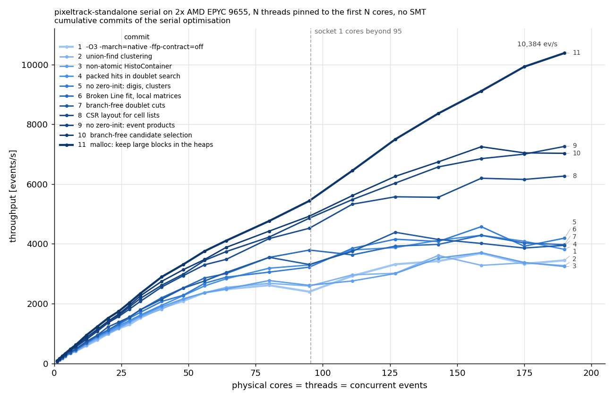
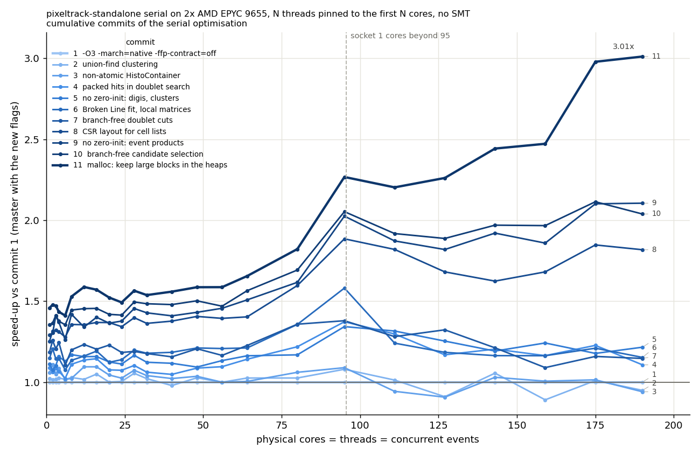

# Optimisation of the `serial` back-end

The `serial` back-end was optimised in #438, with one commit per optimisation, so that the effect of each change can be measured on its own. The results are unchanged: for every commit `--validation` passes, and the histograms produced by `--histogram` are byte-for-byte identical to those of the original version, also when malloc fills new memory with garbage (`GLIBC_TUNABLES=glibc.malloc.perturb=165`), confirming that the code does not rely on zero-initialised memory.

## Changes

1. **Build with `-O3 -march=native -ffp-contract=off`**: `HOST_CXXFLAGS` uses `-O3` and `-march=native` instead of `-O2 -msse3`; `-ffp-contract=off` prevents the contraction of floating point expressions (e.g. into FMA), so that the results stay identical to the default build. A variable used only in an `assert` is marked `[[maybe_unused]]`, to avoid a warning with `-DNDEBUG`. This changes the host flags for all back-ends.
2. **Union-find for the pixel clustering**: the iterative min-label propagation, designed for the parallel GPU implementation, is replaced by a union-find that always keeps the smallest pixel index as the root of each set; the cluster ids are identical.
3. **Non-atomic `HistoContainer`**: each `HistoContainer` is filled by a single thread, so it uses plain increments and decrements, like the rest of the `cudaCompat` layer.
4. **Packed hits in the doublet search**: the quantities of the hits used by the doublet search are copied into a compact array, in the same order as the hits in the phi histogram, so that the search window of each inner hit is scanned contiguously in memory.
5. **No zero-initialisation of the digi, cluster and error buffers**: they are fully written by the kernels before being read, as in the CUDA version; `make_unique_for_overwrite` avoids writing ~10 MB of zeros per event.
6. **Local matrices in the Broken Line fit**: the fast fit and fit kernels are fused, and the hits of each n-tuplet are kept in local Eigen matrices instead of the strided buffers used to coalesce memory accesses on GPUs; this avoids allocating and zeroing the buffers, and accessing them with a stride of many pages.
7. **Branch-free doublet cuts**: the module index, z0 and phi cuts are checked with a single branch, to reduce the mispredicted branches in the doublet search.
8. **CSR layout for the cells of each outer hit**: the array of `VecArray<uint32_t, 128>` (516 bytes per hit) is replaced by an array of offsets and an array of cell indices, filled in cell order after the doublet search; the cells of each hit and the 128 cells limit are unchanged. This reduces the memory footprint and traffic of the doublet search, connect and fishbone steps, and the time spent resetting the per-hit vectors.
9. **No zero-initialisation of the event products and work spaces**: `make_unique_for_overwrite` is used in `CPUTraits`, and for the tracks, vertices and vertex finder work space, as for the CUDA device allocations.
10. **Branch-free selection of the doublet candidates**: for each phi bin, the candidates that pass the cheaper cuts are first selected without branching, then the other cuts are applied and the doublets are created in the original order; this removes most of the mispredicted branches in the doublet search.
11. **Keep the large per-event allocations in the malloc heaps**: glibc malloc is configured (`mallopt`) to serve blocks up to 32 MB from the heaps instead of `mmap()`, and not to trim the heaps. This avoids the page faults and the kernel zeroing new pages on every event, and the contention on the process memory map when many events run concurrently: at 190 threads the CPU usage per thread goes from 63% to 95%.

## Measurements

Measured on a dual-socket AMD EPYC 9655 (Zen 5, 2x 96 cores) with GCC 14.2.1, using only the physical cores (no SMT): a job with N threads and N concurrent events is pinned with `taskset` to the first N cores (socket 0 up to 95 threads, then socket 1). Each job processes max(10000, 500 x N) events after max(1000, 10 x N) warm-up events; each point is a single run, and the run-to-run variation is 1-3% up to 64 threads. The commits were measured with `-march=znver4`; on this machine `-march=native` (i.e. `znver5`) generates the same instructions with slightly different scheduling, and gives the same throughput within 1%.

Throughput in events/s, and in parentheses the speed-up with respect to the previous commit:

| commit | 1 thread | 8 threads | 32 threads | 190 threads |
|---|---:|---:|---:|---:|
| original version | 59.1 | 388.4 | 1520.2 | 3427.8 |
| 1. `-O3 -march=native -ffp-contract=off` | 60.3 (1.02x) | 405.0 (1.04x) | 1520.6 (1.00x) | 3448.2 (1.01x) |
| 2. union-find clustering | 61.6 (1.02x) | 416.3 (1.03x) | 1552.7 (1.02x) | 3272.0 (0.95x) |
| 3. non-atomic `HistoContainer` | 63.7 (1.03x) | 414.1 (0.99x) | 1581.2 (1.02x) | 3241.2 (0.99x) |
| 4. packed hits in the doublet search | 65.5 (1.03x) | 449.4 (1.09x) | 1613.4 (1.02x) | 3815.0 (1.18x) |
| 5. no zero-init: digis, clusters, errors | 67.0 (1.02x) | 473.6 (1.05x) | 1706.6 (1.06x) | 4190.5 (1.10x) |
| 6. Broken Line fit with local matrices | 69.1 (1.03x) | 459.3 (0.97x) | 1791.2 (1.05x) | 3974.0 (0.95x) |
| 7. branch-free doublet cuts | 71.4 (1.03x) | 485.4 (1.06x) | 1788.5 (1.00x) | 3951.1 (0.99x) |
| 8. CSR layout for the cell lists | 75.4 (1.06x) | 549.0 (1.13x) | 2071.9 (1.16x) | 6267.4 (1.59x) |
| 9. no zero-init: event products | 77.9 (1.03x) | 574.7 (1.05x) | 2171.0 (1.05x) | 7258.9 (1.16x) |
| 10. branch-free candidate selection | 81.6 (1.05x) | 585.1 (1.02x) | 2256.3 (1.04x) | 7028.4 (0.97x) |
| 11. malloc: keep large blocks in the heaps | 87.9 (1.08x) | 619.0 (1.06x) | 2337.7 (1.04x) | 10383.5 (1.48x) |

Total speed-up with respect to the original version:

| | 1 thread | 8 threads | 32 threads | 190 threads |
|---|---:|---:|---:|---:|
| all commits | 1.49x | 1.59x | 1.54x | 3.03x |

Up to commit 10, the throughput at 190 threads is limited by the contention on the process memory map caused by the per-event `mmap()`/`munmap()` of the large buffers: the threads are busy only 40-75% of the time, and the results vary by about 10% between runs. The CSR layout, the removal of the zero-initialisation of the event products, and the malloc configuration are the changes that let the throughput scale to all cores.

Throughput vs number of cores for each commit:

Speed-up with respect to commit 1 (the original version with the new compiler flags) vs number of cores:

